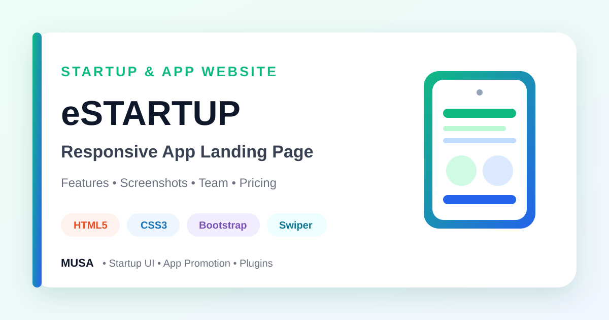

<div align="center">



# eStartup — Responsive Startup & App Landing Page

### A feature-rich Bootstrap startup website with app promotion, services, courses, team, pricing, screenshots, and animated sections.


[](https://github.com/samusa099)
[](https://developer.mozilla.org/docs/Web/HTML)
[](https://developer.mozilla.org/docs/Web/CSS)
[](https://getbootstrap.com/)
[](https://developer.mozilla.org/docs/Web/JavaScript)

[](https://github.com/samusa099/Project_01)
[](https://github.com/samusa099/Project_01)
[](https://github.com/samusa099/Project_01/commits/main)

</div>

---

## 📌 Overview

A complete startup and app-promotion interface featuring animated sections, features, screenshots, courses, team members, pricing, sliders, calls to action, and contact content.

## 📚 Documentation

| Resource | Description |
|---|---|
| [**HOW_TO_USE.md**](HOW_TO_USE.md) | Detailed file map plus customisation, plugin, reuse, and deployment guidance |
| [**Repository Cover**](assets/repository-cover.svg) | Scalable professional cover used in this README |

## ✨ Key Features

- Startup and app-focused hero
- Feature and about sections
- Screenshot and course showcases
- Team and pricing sections
- AOS animations, Swiper, and GLightbox
- Responsive navigation and contact content

## 🗂️ Repository Structure

```text
Project_01/
├── index.html
├── css/
├── js/
├── img/
├── vendor/
├── assets/
│   └── repository-cover.svg
├── HOW_TO_USE.md
└── README.md
```

## 🚀 Run Locally

```bash
git clone https://github.com/samusa099/Project_01.git
cd Project_01
```

Open `index.html` in a browser or use **VS Code Live Server**.

> Store links, pricing actions, and the contact form are front-end placeholders until connected to real services.

## 👤 Author

<div align="center">

### Musa

**Internationally certified HR professional and data analytics practitioner from Bangladesh.**  
Musa combines people operations, Excel, Power BI, SQL, and technology-driven problem-solving to build practical, structured, and user-focused projects.

[](https://github.com/samusa099)

</div>
